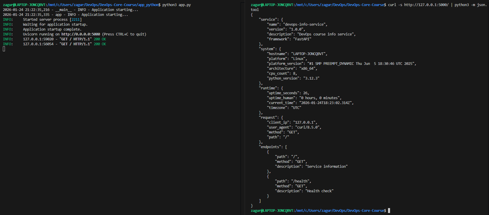
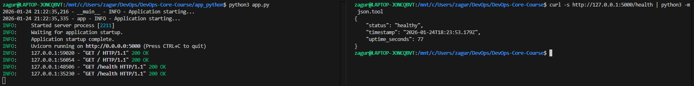
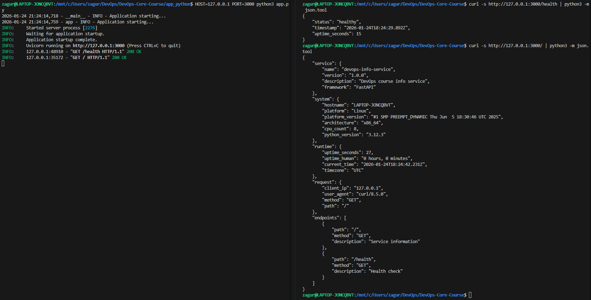

# LAB01 -- DevOps Info Service Implementation

## Framework Selection

### Choice: **FastAPI**

I chose FastAPI because it's a lightweight and efficient framework specifically designed for building APIs, which is exactly what the lab requires. Since this is a DevOps course, a full-featured framework like Django would be overkill, as it includes many features we don't need, like an ORM for databases. FastAPI is fast, easy to learn, and supports asynchronous programming, making it ideal for scalable, performance-oriented services in a DevOps context. Additionally, it provides automatic API documentation, which is very useful for rapid development and testing.

### Comparison Table

| Feature                           | **FastAPI**                      | Flask                           | Django                         |
|------------------------------------|----------------------------------|---------------------------------|--------------------------------|
| **Type**             | micro-web framework| micro-web framework| full-stack web framework|
| **Asynchronous support**           | built-in async support             | limited (with extensions)       | possible with help of Asyncio but slower.|
| **Automatic API documentation**    | Yes (Swagger, ReDoc)             | Requires extensions (Flask-RESTful, Flask-OpenAPI) | Yes (DRF with auto docs) |
| **Performance**                    | very fast for building APIs and microservices|slower because of manual validation and synchronised programming| fast for building large web applications |
| **Learning curve**                 | Easy                    | Moderate                            | Complex                          |
| **Flexibility**                    | High                             | High                            | Low (more opinionated)         |
| **Documentation**                    | clear, but smaller                             | large                            |extensive         |

---

## Best Practices Applied

### 1. **Clean Code Organization**

- **Clear function names**: Functions are named descriptively to improve readability and maintainability.
  
    Example:
    ```python
    def get_uptime_seconds():
        """Calculate the uptime of the application."""
    ```
- **Grouping imports**: All imports are grouped into standard library imports, followed by third-party and local imports.
  
    Example:
    ```python
    import os
    import socket
    import platform
    from datetime import datetime, timezone
    ```

- **Comments and docstrings**: Comments are minimal, used only where the code is not self-explanatory, and function docstrings are added to describe their purpose.

    Example:
    ```python
    def iso_utc_now() -> str:
        """Returns the current time in ISO 8601 UTC format."""
        dt = datetime.now(timezone.utc)
        return dt.strftime("%Y-%m-%dT%H:%M:%S.%f")[:-3] + "Z"
    ```

### 2. **Error Handling**

- FastAPI handles errors automatically, but custom error handling can be added for cases like 404 (Not Found) and 500 (Internal Server Error).
  
    Example:
    ```python
    @app.exception_handler(404)
    async def not_found_exception(request: Request, exc: HTTPException):
        return JSONResponse(
            status_code=404,
            content={"message": "Endpoint not found", "error": str(exc)},
        )
    ```

    This allows us to give more informative and controlled responses for errors.

### 3. **Logging**

- Implemented logging to capture important application events and errors.
  
    Example:
    ```python
    import logging

    logging.basicConfig(
        level=logging.INFO,
        format='%(asctime)s - %(name)s - %(levelname)s - %(message)s'
    )
    logger = logging.getLogger(__name__)

    logger.info('Application starting...')
    ```

Logging helps in tracing application behavior and troubleshooting issues.

### 4. **PEP 8 Compliance**

- Adhered to Python’s **PEP 8** guidelines, including consistent naming conventions, indentation, and spacing.

    Example:
    ```python
    def system_info() -> dict:
        """Returns system information like hostname, platform, and architecture."""
        return {
            "hostname": socket.gethostname(),
            "platform": platform.system(),
            "platform_version": platform.version(),
            "architecture": platform.machine(),
            "cpu_count": os.cpu_count() or 0,
            "python_version": platform.python_version(),
        }
    ```

---

## API Documentation

### Request/Response Examples

#### `GET /`

**Request Example:**
```bash
curl http://127.0.0.1:5000/
```

Response Example:

```json
{
  "service": {
    "name": "devops-info-service",
    "version": "1.0.0",
    "description": "DevOps course info service",
    "framework": "FastAPI"
  },
  "system": {
    "hostname": "my-laptop",
    "platform": "Linux",
    "platform_version": "Ubuntu 24.04",
    "architecture": "x86_64",
    "cpu_count": 8,
    "python_version": "3.9.6"
  },
  "runtime": {
    "uptime_seconds": 3600,
    "uptime_human": "1 hour, 0 minutes",
    "current_time": "2026-01-07T14:30:00.000Z",
    "timezone": "UTC"
  },
  "request": {
    "client_ip": "127.0.0.1",
    "user_agent": "curl/7.81.0",
    "method": "GET",
    "path": "/"
  },
  "endpoints": [
    {"path": "/", "method": "GET", "description": "Service information"},
    {"path": "/health", "method": "GET", "description": "Health check"}
  ]
}
```

#### `GET /health`

Returns a simple health status, useful for monitoring and Kubernetes probes.

**Request Example:**
```bash
curl http://127.0.0.1:5000/health
```

Example response:

```json
{
  "status": "healthy",
  "timestamp": "2024-01-15T14:30:00.000Z",
  "uptime_seconds": 3600
}
```

### Testing commands

1. Test the `/` endpoint:

    ```bash
    curl -s http://127.0.0.1:5000/ | python -m json.tool
    ```

2. Test the `/health` endpoint:

    ```bash
    curl -s http://127.0.0.1:5000/health | python -m json.tool
    ```

## Testing evidence

### Screenshots showing endpoints work

1. `01-main-endpoint`:


2. `02-health-check`:


3. `03-formatted-output`:


### Terminal output showing successful response

1. 01-main-endpoint

```bash
zagur@LAPTOP-JONCQBVT:/mnt/c/Users/zagur/DevOps/DevOps-Core-Course$ curl -s http://127.0.0.1:3000/ | python3 -m json.tool
{
    "service": {
        "name": "devops-info-service",
        "version": "1.0.0",
        "description": "DevOps course info service",
        "framework": "FastAPI"
    },
    "system": {
        "hostname": "LAPTOP-JONCQBVT",
        "platform": "Linux",
        "platform_version": "#1 SMP PREEMPT_DYNAMIC Thu Jun  5 18:30:46 UTC 2025",
        "architecture": "x86_64",
        "cpu_count": 8,
        "python_version": "3.12.3"
    },
    "runtime": {
        "uptime_seconds": 3,
        "uptime_human": "0 hours, 0 minutes",
        "current_time": "2026-01-24T18:38:52.811Z",
        "timezone": "UTC"
    },
    "request": {
        "client_ip": "127.0.0.1",
        "user_agent": "curl/8.5.0",
        "method": "GET",
        "path": "/"
    },
    "endpoints": [
        {
            "path": "/",
            "method": "GET",
            "description": "Service information"
        },
        {
            "path": "/health",
            "method": "GET",
            "description": "Health check"
        }
    ]
}
``` 

2. 02-health-check

```bash
zagur@LAPTOP-JONCQBVT:/mnt/c/Users/zagur/DevOps/DevOps-Core-Course$ curl -s http://127.0.0.1:3000/health | python3 -m json.tool
{
    "status": "healthy",
    "timestamp": "2026-01-24T18:39:57.365Z",
    "uptime_seconds": 67
}
```

## Challenges & Solutions

**Problem:** Since I'm not very familiar with the syntax of FastAPI and Python, I encountered several syntax errors while writing the code, such as incorrect function definitions or missing imports. These errors caused issues like the app failing to start or returning unexpected results.

**Solution:** To resolve this, I carefully referred to the FastAPI documentation and Python's official documentation. I also ran the app frequently during development to catch any issues early. Debugging with error messages and checking online resources helped me understand and correct mistakes in the syntax.

## GitHub Community

1. **Why stars matter in open source:** Stars are the way to discover, bookmark, and show appreciation for interesting and promising projects. The more stars a repo has, the more popular and trusted it is. This helps projects get more visibility and attract more contributors.

2. **How followers can help:** Following developers lets you stay updated on their work and learn from them. It also helps you find potential teammates for future projects and stay aware of new technologies.