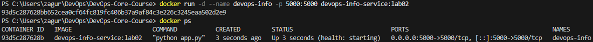
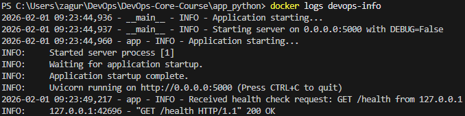
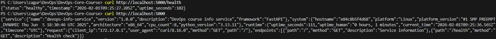

# LAB02 -- Docker Containerization

## 1. Docker Best Practices Applied

### 1.1 Specific base image version
Used: `python:3.13-slim`

<b>Why it matters:</b>
- Pinned major/minor version improves reproducibility (same interpreter + base libs)
- `slim` reduces image size vs full Debian images

<b>Dockerfile snippet:</b>
```dockerfile
FROM python:3.13-slim AS builder
FROM python:3.13-slim AS runtime
```

### 1.2 Non-root user

Implemented with <code>adduser/addgroup</code> and <code>USER app</code>

<b>Why it matters:</b>
- Reduces impact if the app is compromised
- Prevents accidental writers to system paths

<b>Snippet:</b>
```dockerfile
RUN addgroup --system app \
 && adduser --system --ingroup app --home /home/app --shell /usr/sbin/nologin app
USER app
```

### 1.3 Proper layer ordering (dependency caching)

Copied <code>requirements.txt</code> before the code

<b>Why it matters:</b>
- Docker cache can reuse the dependency layer if only app changes
- Faster rebuilds development

### 1.4 Copy only necessary files

The runtime image contains only:
- <code>requirements.txt</code> (for install step)
- <code>app.py</code> (runtime code)

<b>Why it matters:</b>
- Smaller image
- Less attack surface (no tests/docs/dev artifacts)

### 1.5 <code>.dockerignore</code>

Excluded: caches, venvs, docs, tests

<b>Why it matters:</b>
- Smaller build context → faster builds
- Avoid leaking local artifacts into the build

### 1.6 Multi-stage build (optimization)
 
- Stage 1 builds wheels
- Stage 2 installs from wheels with --no-index

<b>Why it matters:</b>
- Cleaner runtime stage
- More reproducible installs (install exactly built artifacts)
- Better separation of responsibilities

## 2. Image Information & Decisions

### 2.1 Base image choice

<b>Chosen:</b> python:3.13-slim

<b>Justification:</b> Small footprint, still compatible with most Python packages

### 2.2 Final image size


<b>Image size:</b> 165MB

<b>Assessment:</b>
- **165MB** is reasonable for a FastAPI service on `python:3.13-slim` because the final size includes:
  - the Python runtime + Debian slim base layers
  - installed dependencies (FastAPI, Uvicorn, etc.)
- The image is already optimized by:
  - using `slim` instead of full image
  - multi-stage build (wheels built in builder stage)
  - not shipping tests/docs and using `.dockerignore`
- Further possible reductions (optional):
  - switch to a smaller runtime base (e.g., distroless python) if compatible
  - ensure only runtime deps are installed (no dev/test deps)
  - audit dependencies to reduce transitive packages

### 2.3 Layer structure

<b>Command:</b>
```bash
docker history devops-info-service:lab02
```

```powershell
PS C:\Users\zagur\DevOps\DevOps-Core-Course\app_python> docker history devops-info-service:lab02
IMAGE          CREATED          CREATED BY                                      SIZE      COMMENT
8eb6994eaeaa   14 seconds ago   CMD ["python" "app.py"]                         0B        buildkit.dockerfile.v0
<missing>      14 seconds ago   HEALTHCHECK &{["CMD-SHELL" "python -c \"impo…   0B        buildkit.dockerfile.v0
<missing>      14 seconds ago   EXPOSE map[5000/tcp:{}]                         0B        buildkit.dockerfile.v0
<missing>      14 seconds ago   USER app                                        0B        buildkit.dockerfile.v0
<missing>      14 seconds ago   COPY app.py . # buildkit                        4.63kB    buildkit.dockerfile.v0
<missing>      14 seconds ago   RUN /bin/sh -c python -m pip install --no-in…   38.1MB    buildkit.dockerfile.v0
<missing>      17 seconds ago   COPY requirements.txt . # buildkit              43B       buildkit.dockerfile.v0
<missing>      17 seconds ago   COPY /wheels /wheels # buildkit                 9.48MB    buildkit.dockerfile.v0
<missing>      28 seconds ago   RUN /bin/sh -c addgroup --system app  && add…   4.3kB     buildkit.dockerfile.v0
<missing>      24 hours ago     WORKDIR /app                                    0B        buildkit.dockerfile.v0
<missing>      24 hours ago     ENV PYTHONDONTWRITEBYTECODE=1 PYTHONUNBUFFER…   0B        buildkit.dockerfile.v0
<missing>      2 weeks ago      CMD ["python3"]                                 0B        buildkit.dockerfile.v0
<missing>      2 weeks ago      RUN /bin/sh -c set -eux;  for src in idle3 p…   36B       buildkit.dockerfile.v0
<missing>      2 weeks ago      RUN /bin/sh -c set -eux;   savedAptMark="$(a…   35.2MB    buildkit.dockerfile.v0
<missing>      2 weeks ago      ENV PYTHON_SHA256=16ede7bb7cdbfa895d11b0642f…   0B        buildkit.dockerfile.v0
<missing>      2 weeks ago      ENV PYTHON_VERSION=3.13.11                      0B        buildkit.dockerfile.v0
<missing>      2 weeks ago      ENV GPG_KEY=7169605F62C751356D054A26A821E680…   0B        buildkit.dockerfile.v0
<missing>      2 weeks ago      RUN /bin/sh -c set -eux;  apt-get update;  a…   3.81MB    buildkit.dockerfile.v0
<missing>      2 weeks ago      ENV PATH=/usr/local/bin:/usr/local/sbin:/usr…   0B        buildkit.dockerfile.v0
<missing>      2 weeks ago      # debian.sh --arch 'amd64' out/ 'trixie' '@1…   78.6MB    debuerreotype 0.17
```

**Explanation:**

- **Stable layers (change rarely):**
  - Base image layers from `python:3.13-slim` (Debian OS + Python runtime).
  - Creation of the non-root user (`addgroup` / `adduser`).
  - Dependency installation layer (`pip install --no-index --find-links=/wheels`) **as long as `requirements.txt` does not change**.

- **Frequently changing layer:**
  - `COPY app.py .` — any change in the application code invalidates only this layer and the layers above it, which makes rebuilds fast.

- **Why the layer order matters:**
  - `requirements.txt` is copied and dependencies are installed **before** copying the application code.
  - This allows Docker to reuse cached dependency layers when only the source code changes.
  - As a result, rebuilds are significantly faster during development.

- **Size observation:**
  - The largest custom layer in the image is the dependency installation (~38MB).
  - The application code itself is very small (~4.6KB), showing that most of the image size comes from the base image and Python packages, not from the app.


## 3. Build & Run Process
### 3.1 Build output

```bash
PS C:\Users\zagur\DevOps\DevOps-Core-Course\app_python> docker build -t devops-info-service:lab02 .
>>
[+] Building 31.0s (16/16) FINISHED                     docker:desktop-linux
 => [internal] load build definition from Dockerfile                    0.0s
 => => transferring dockerfile: 1.13kB                                  0.0s 
 => WARN: FromAsCasing: 'as' and 'FROM' keywords' casing do not match   0.0s 
 => [internal] load metadata for docker.io/library/python:3.13-slim     2.6s 
 => [auth] library/python:pull token for registry-1.docker.io           0.0s 
 => [internal] load .dockerignore                                       0.1s
 => => transferring context: 342B                                       0.0s 
 => [internal] load build context                                       0.1s
 => => transferring context: 4.75kB                                     0.0s 
 => [builder 1/4] FROM docker.io/library/python:3.13-slim@sha256:51e1a  5.3s 
 => => resolve docker.io/library/python:3.13-slim@sha256:51e1a0a317fdb  0.0s 
 => => sha256:51e1a0a317fdb6e170dc791bbeae63fac5272c 10.37kB / 10.37kB  0.0s
 => => sha256:fbc43b66207d7e2966b5f06e86f2bc46aa4b10f3 1.75kB / 1.75kB  0.0s 
 => => sha256:dd4049879a507d6f4bb579d2d94b591135b95daa 5.53kB / 5.53kB  0.0s 
 => => sha256:119d43eec815e5f9a47da3a7d59454581b1e20 29.77MB / 29.77MB  1.8s 
 => => sha256:8843ea38a07e15ac1b99c72108fbb492f7370329 1.29MB / 1.29MB  1.7s 
 => => sha256:0bee50492702eb5d822fbcbac8f545a25f5fe1 11.79MB / 11.79MB  2.7s
 => => sha256:36b6de65fd8d6bd36071ea9efa7d078ebdc11ecc23d2 249B / 249B  2.1s 
 => => extracting sha256:119d43eec815e5f9a47da3a7d59454581b1e204b0c34d  1.7s 
 => => extracting sha256:8843ea38a07e15ac1b99c72108fbb492f737032986cc0  0.3s 
 => => extracting sha256:0bee50492702eb5d822fbcbac8f545a25f5fe173ec803  0.9s 
 => => extracting sha256:36b6de65fd8d6bd36071ea9efa7d078ebdc11ecc23d24  0.0s 
 => [runtime 2/7] WORKDIR /app                                          0.3s 
 => [builder 2/4] WORKDIR /build                                        0.3s 
 => [runtime 3/7] RUN addgroup --system app  && adduser  --system --in  1.0s 
 => [builder 3/4] COPY requirements.txt .                               0.1s 
 => [builder 4/4] RUN python -m pip install --upgrade pip  && python   15.5s 
 => [runtime 4/7] COPY --from=builder /wheels /wheels                   0.1s 
 => [runtime 5/7] COPY requirements.txt .                               0.1s 
 => [runtime 6/7] RUN python -m pip install --no-index --find-links=/w  5.8s 
 => [runtime 7/7] COPY app.py .                                         0.0s 
 => exporting to image                                                  0.3s 
 => => exporting layers                                                 0.3s 
 => => writing image sha256:2ef988bd86b19dd70ff6a63c17cf3c2d78aec55343  0.0s 
 => => naming to docker.io/library/devops-info-service:lab02            0.0s 

View build details: docker-desktop://dashboard/build/desktop-linux/desktop-linux/lpcyojni4xwvqtruz2h4lyk77    

What's next:
    View a summary of image vulnerabilities and recommendations → docker scout quickview
```

### 3.2 Run output (container logs)

Commands:
```bash
docker run -d --name devops-info -p 5000:5000 devops-info-service:lab02
docker ps
docker logs devops-info
```





### 3.3 Endpoint tests

Commands:

curl http://localhost:5000/
curl http://localhost:5000/health


Outputs:

```bash
PS C:\Users\zagur\DevOps\DevOps-Core-Course> curl http://localhost:5000/health
{"status":"healthy","timestamp":"2026-02-01T09:25:27.205Z","uptime_seconds":102}
PS C:\Users\zagur\DevOps\DevOps-Core-Course> curl http://localhost:5000
{"service":{"name":"devops-info-service","version":"1.0.0","description":"DevOps course info service","framework":"FastAPI"},"system":{"hostname":"e84c8b5f4d68","platform":"Linux","platform_version":"#1 SMP PREEMPT_DYNAMIC Thu Jun  5 18:30:46 UTC 2025","architecture":"x86_64","cpu_count":8,"python_version":"3.13.11"},"runtime":{"uptime_seconds":111,"uptime_human":"0 hours, 1 minutes","current_time":"2026-02-01T09:25:36.565Z","timezone":"UTC"},"request":{"client_ip":"172.17.0.1","user_agent":"curl/8.16.0","method":"GET","path":"/"},"endpoints":[{"path":"/","method":"GET","description":"Service information"},{"path":"/health","method":"GET","description":"Health check"}]}
```



### 3.4 Docker Hub

Repository: `wkwtfigo/devops-info-service`

Docker Hub URL:
```text
https://hub.docker.com/r/wkwtfigo/devops-info-service
```

<b>Push output:</b>

```bash
PS C:\Users\zagur\DevOps\DevOps-Core-Course> docker push wkwtfigo/devops-info-service:lab02 
The push refers to repository [docker.io/wkwtfigo/devops-info-service]
6a094d39e043: Pushed
8b8714259814: Pushed
0c5a41331b54: Pushed
7a93808411ef: Pushed 
5b31ce4e2f66: Pushed
014fb08f1599: Pushed
a915d0aa80cd: Pushed
ad1b18dd62d2: Pushed
d85cc8d16465: Mounted from library/python
e50a58335e13: Mounted from library/python
lab02: digest: sha256:5936cd71eb78ae5a3b17cd47b34156c6c061cc549ce06d46d9c365234cc2d2a2 size: 2411
PS C:\Users\zagur\DevOps\DevOps-Core-Course> docker push wkwtfigo/devops-info-service:latest
The push refers to repository [docker.io/wkwtfigo/devops-info-service]
6a094d39e043: Layer already exists
8b8714259814: Layer already exists
0c5a41331b54: Layer already exists
7a93808411ef: Layer already exists
5b31ce4e2f66: Layer already exists
014fb08f1599: Layer already exists
a915d0aa80cd: Layer already exists
ad1b18dd62d2: Layer already exists
d85cc8d16465: Layer already exists
e50a58335e13: Layer already exists
latest: digest: sha256:5936cd71eb78ae5a3b17cd47b34156c6c061cc549ce06d46d9c365234cc2d2a2 size: 2411
PS C:\Users\zagur\DevOps\DevOps-Core-Course> docker push wkwtfigo/devops-info-service:1.0.0 
The push refers to repository [docker.io/wkwtfigo/devops-info-service]
6a094d39e043: Layer already exists
8b8714259814: Layer already exists
0c5a41331b54: Layer already exists
7a93808411ef: Layer already exists
d85cc8d16465: Layer already exists
e50a58335e13: Layer already exists
1.0.0: digest: sha256:5936cd71eb78ae5a3b17cd47b34156c6c061cc549ce06d46d9c365234cc2d2a2 size: 2411
```

## 4. Technical Analysis
### 4.1 Why this Dockerfile works

<code>CMD ["python", "app.py"]</code> matches local workflow: <code>app.py</code> starts <code>uvicorn</code> and reads env vars. <code>EXPOSE 5000</code> documents the port used by the app. Dependencies are installed before copying application code to maximize caching.

### 4.2 What happens if layer order changes?

If we copy all files before installing dependencies:
- Any code change invalidates the cache
- Docker will reinstall dependencies on every build → much slower builds

### 4.3 Security considerations

- Non-root runtime user
- Minimal base image (slim)
- No extra tools installed (e.g., curl) → smaller attack surface

### 4.4 How .dockerignore improves the build

- Reduces amount of data sent to Docker daemon
- Prevents accidental inclusion of venv/caches/tests/docs
- Speeds up build and reduces image clutter

## 5. Challenges & Solutions

### 5.1 Docker Hub authentication/network issue during build
- **Issue:** Docker failed to fetch OAuth token from Docker Hub (`auth.docker.io/token`) and could not pull the base image.
- **Debug:** Verified that `docker pull python:3.13-slim` failed, checked network/DNS connectivity.
- **Fix:** Restarted Docker Desktop / WSL networking and adjusted network settings (DNS/proxy) until pull worked.
- **Lesson learned:** Docker builds depend on registry access; when base images cannot be pulled, the issue is usually network/DNS/proxy rather than Dockerfile syntax.

### 5.2 Dockerfile linter warning (FROM/AS casing)
- **Issue:** Build produced warning `FromAsCasing: 'as' and 'FROM' keywords' casing do not match`.
- **Fix:** Replaced `as` with `AS` in multi-stage `FROM ... AS ...` lines.
- **Lesson learned:** Even non-fatal warnings should be fixed to keep the build output clean and professional.

